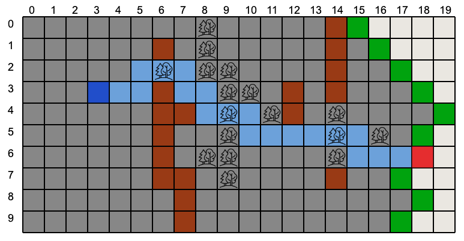

# PathfindingJS

PathfindingJS is a JavaScript library that implements different algorithms to find the shortest path in a grid map between two nodes.

## Installation

You can install the library using Yarn:

```sh
yarn add demyanovs/pathfinding-js
```

Or using npm:

```sh
npm install demyanovs/pathfinding-js
```

## Usage

PathfindingJS is available as a JavaScript module for both the browser and Node.js.

### Supported Algorithms

* A*
* BFS (Breadth-First Search)
* GBFS (Greedy Best-First Search)
* Dijkstra

### A* Algorithm

```javascript
import {AStar, GridMap} from "../../src/index.js";

const grid = new GridMap(10, 20);

const walls = [[6, 1], [6, 3], [6, 4], [6, 5], [6, 6], [6, 7], [7, 7], [7, 4], [7, 8], [7, 9], [12, 3], [12, 4], [14, 0], [14, 1], [14, 2], [14, 3], [14, 7]];
walls.forEach((wall) => {
    grid.setIsPassable(wall[0], wall[1], false);
});

const map = new AStar(grid);
const start = [3, 3];
const end = [18, 6];
const path = map.findPath(start, end);

console.log(path);
```

All examples are available in the [examples](../master/examples/) folder.



## Testing

To run the tests, use the following command:

```sh
yarn test
```

Or with npm:

```sh
npm test
```

## Contributing
Pull requests are welcome. For major changes, please open an issue first to discuss what you would like to change.

Please make sure to update tests as appropriate.

## License
[MIT](LICENSE.md)
